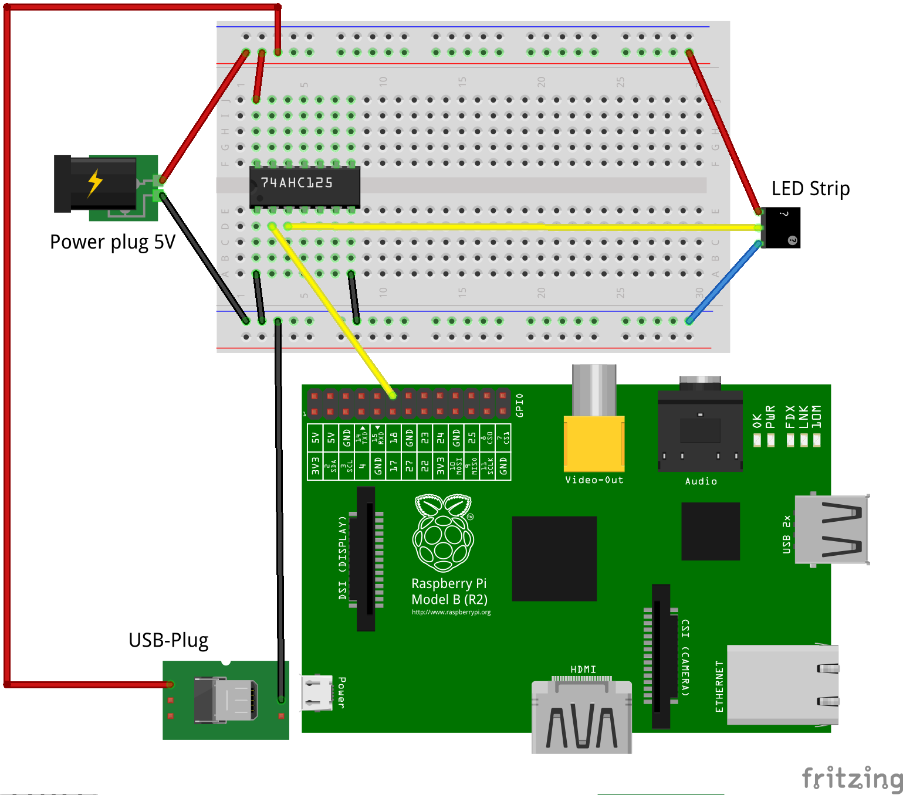

Flaschenwand
============

Das Projekt wurde inspiriert durch die [Matewand des 32C3](http://matelight.rocks/).

Material
========

  - [MicroPython Smart Holiday Lights](https://learn.adafruit.com/micropython-smart-holiday-lights)
  - [Adafruit NeoPixel Digital RGB LED Strip - Black 60 LED - BLACK](https://www.adafruit.com/products/1461)
  - [Medium 16x32 RGB LED matrix panel](https://www.adafruit.com/products/420)
  - [12mm Diffused Thin Digital RGB LED Pixels (Strand of 25) - WS2801](https://www.adafruit.com/products/322) 25 Pixel als "Lichterkette". Im Adafruit Shop leider recht hohe Versandkosten >20€.
  - [Lichterkette mit steuerbaren LEDs (43€)](http://www.exp-tech.de/12mm-diffused-flat-digital-rgb-led-pixels-strand-of-25-ws2801)
  - [bei Ebay](http://www.ebay.de/sch/i.html?_odkw=adafruit&_osacat=0&_from=R40&_trksid=p2045573.m570.l1313.TR0.TRC0.H0.Xdiffused+rgb+led.TRS0&_nkw=diffused+rgb+led&_sacat=0)
  - [bei Amazon](https://www.amazon.de/WS2811-Pixels-digital-Addressable-String/dp/B00MXW054Y/ref=sr_1_4?s=kitchen&ie=UTF8&qid=1483302387&sr=1-4&keywords=WS2801)

Bauteile
========

WS2812B mit dem Controller WS2811 scheinen eine gute Lösung zu sein.

Level-Shifter: 3V -> 5V

[Adafruit](https://www.adafruit.com/products/1787)
[Datenblatt](https://cdn-shop.adafruit.com/datasheets/74AHC125.pdf) [PDF](doc/74AHC125.pdf)

Händler
=======

[Sparkfun](https://www.sparkfun.com/)
Versandkosten ~ 8,50€ - 2.6 Wochen Lieferzeit

Lieferanten

  - http://www.mikrocontroller.net/articles/Hauptseite
  - http://www.mikrocontroller.net/articles/Elektronikversender

[Elektronik Wunderland (Bochum)](http://www.elektronik-wunderland.de/)

Anleitung
=========

[Christmas LED Matrix](http://www.aoakley.com/articles/2015-11-18-raspberry-pi-christmas-led-matrix.php)

https://learn.adafruit.com/neopixels-on-raspberry-pi?view=all

[PDF](doc/neopixels-on-raspberry-pi.pdf)

[Lib für den Pi](https://github.com/jgarff/rpi_ws281x)

    $ git clone https://github.com/jgarff/rpi_ws281x.git

Vortrag der Pi and More: [Led Matrix mit der ESP8266](https://www.youtube.com/watch?v=0Q-DeAC4_y4&list=WL&index=23)

Verschiedene mögliche Probleme bzgl. HDMI und Audio des Pi werden in
[#104](https://github.com/jgarff/rpi_ws281x/issues/103)
beschrieben. So muss das Soundmodul snd_bcm2835 deaktiviert werden, da
es mit dem PWM-Pin konkurriert. Die erfolgt duch

    $ sudo bash -c "echo 'blacklist snd_bcm2835' >> /etc/modprobe.d/raspi-blacklist.conf"

Das Projekt acab des Münchener CCC stellt in seinem 
[Repo](https://github.com/muccc/acab-streetlife?files=1) verschiedene Demos 
bereit.

Alternativen
============

  * Phillips Hue-System: Bridge mit Birnen (ca. 150€)
  * Osram Lightify (Controller + Birne ab ca. 60€)

Das Projekt [ACAB (all colors are beautiful)](http://acab.muc.ccc.de/)
könnte mit anderen Boxen nachgebaut werden:

  * [Tedi Schubladenturm (10€)](http://www.tedi-shop.com/home-haushalt/aufbewahrung/schubladenturm.html)

Im ACAB repo befinden sich diverse
[Animationen](https://github.com/muccc/acab-streetlife/tree/master/animations),
die auf LED-Displays mit geringer Auflösung (16x6) abgespielt werden
können.

Dass Projekt [WLED](https://kno.wled.ge/) nutzt für die Ansteuerung einen
ESP8266 bzw. ESP32.

Demo
====

Nach einer ersten Inbetriebnahme sind folgende Videos entstanden.

  * [Video 1](doc/VID_20170122_133600.mp4) - kleiner Strip
  * [Video 2](doc/VID_20170122_171614.mp4) - Lichterkette
  * [Video 3](doc/flaschen_in_kiste.mp4) - Flaschen in Kiste

Anschluss
=========

Pinout des Level-Shifters:

          ┌─────────┐
     1~OE ┤1 O    14├ Vcc
     1A   ┤2      13├ 4~OE
     1Y   ┤3      12├ 4A
     2~OE ┤4      11├ 4Y
     2A   ┤5      10├ 3~OE
     2Y   ┤6       9├ 3A
     GND  ┤7       8├ 3Y
          └─────────┘

Anschluss an den Pi (unten), das Netzteil (links), den Level-Shifter
(Steckbrett mit dem 74AHC125 in der Mitte) und die LEDs (rechts). Die
LEDs werden der Farben entsprechend verbunden: rot (+5V), blau (GND),
weiß (DataIn).

Die LED werden in den Flaschen versenkt. Wichtig ist der korrekte
Abstand der Öffnungen - in diesem Fall dürfen 7cm nicht überschritten
werden. Die einzelnen LED werden mit einer Büroklammer fixiert, damit
sie nicht zu leicht herausfallen.

Die Flasche unten links markiert auch auf der Vorderseite unten links
den Beginn der Kette.

Zwei Kisten lassen sich auch nebeneinander anordnen.

Der Pi kann ebenfalls über das Netzteil mit Strom versorgt werden. Dazu wird
ein USB-Stecker mit der Stromversorgung und dieser mit dem Pi verbunden.

Text
====

Der Font stammt von der Seite https://robey.lag.net/2010/01/23/tiny-monospace-font.html

Ansteuerung über Hardware
=========================

Die Ansteuerung der Farben oder Sequenzen kann über einen Hardware-Controller
erfolgen.

  * Potentiometer (regebarer Widerstand) mit AD-Wandler
  * Joypad
  * Midi-Controller: Keyboard, Tasten, Drehregler etc.
  * [OSC](https://de.wikipedia.org/wiki/Open_Sound_Control)-Controller als
    App. [Demo](https://youtu.be/yzpNVKG0z_oo)

Eine Realisierung der Idee, LEDs mit Signalsteuerung zu kombinieren, zeigt das
Video
[NeoPixel Color Synthesis Experiments with Tony D! ](https://www.youtube.com/watch?v=rqRHkCA6TJ4).
